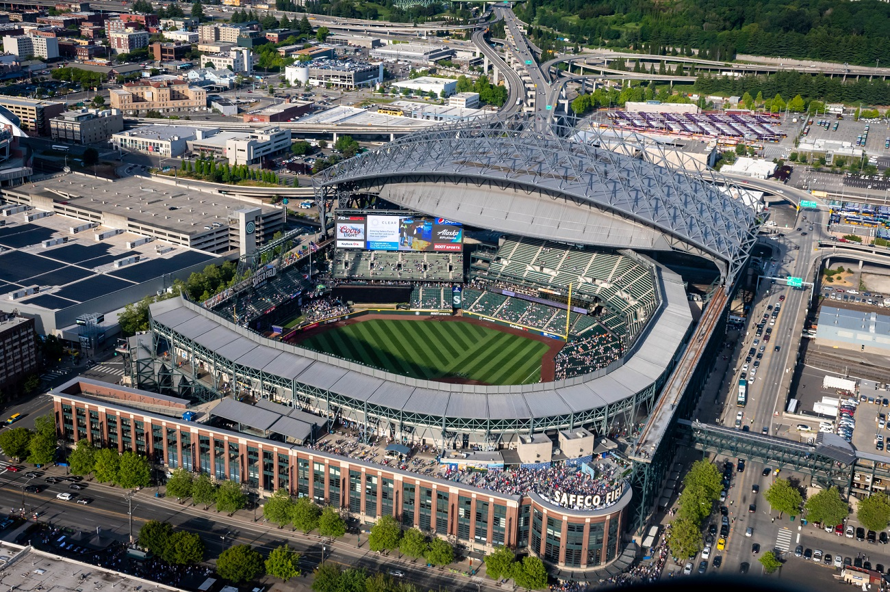
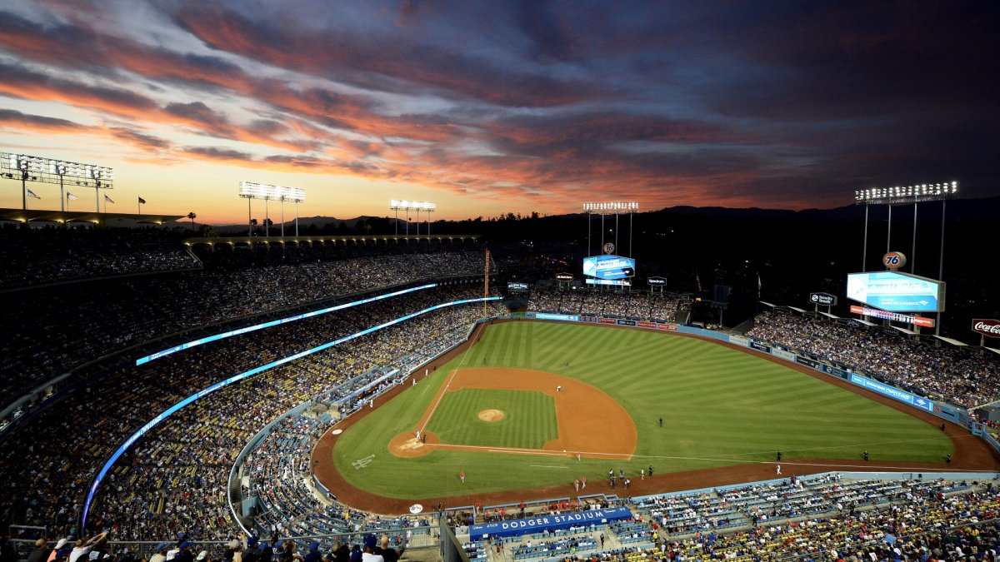
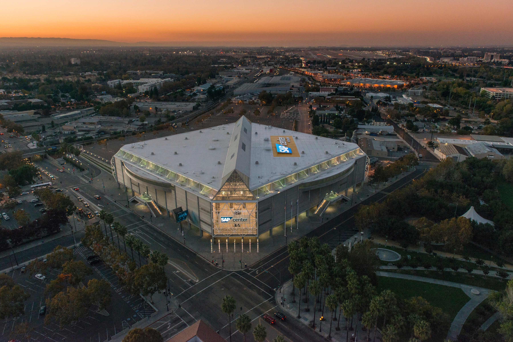
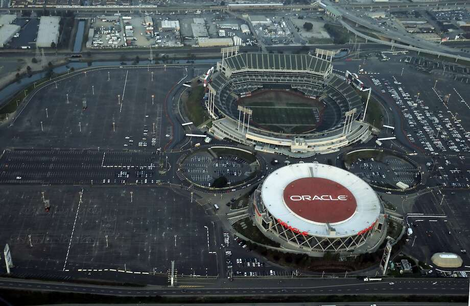

## Insightful Sites

### Sports, Jobs, And Taxes: Are New Stadiums Worth the Cost? (Brookings)
Debunks the myth of stadiums spurring economic development of cities. Explains the discrepancy between gross and net economic effects while considering the investment offered by the city versus stadium’s net gain. 

### Who paid for your stadium? (Global Sport Matters) 
This site provides statistics for every existing stadium across four major professional sports leagues in the U.S. and how it was paid for.

### Is there a better way to pay for a stadium? (The Atlantic) 
Discusses how sport teams are cognizant of public disapproval towards financing stadiums so they’ve shifted towards economic development of neighborhoods (ie. Laker and LA Live).

### Sports Stadiums Are a Bad Deal for Cities (The Atlantic) 

### “The Public Finance of Sport”, The Economics of Sports by Michael Leeds
This chapter discusses the four eras of stadium construction and how stadiums have evolved across time to be viewed as centerpieces of urban development. Also discussed is the different methods of raising revenue that local governments use to fund subsidies (i.e. hotel taxes, sin taxes, tax-free bonds) 

## Dataset

The majority of our data will come from the US Census Bureau, narrowed by zip code to allow for a more precise understanding of the neighborhood(s) around the stadiums than a citywide analysis. The main demographic variables we will be analyzing are race, property value, and financial factors. Specifically within housing, we are thinking of looking at housing value and purchasing price. For financial factors, we will be analyzing median household income and earnings. After finalizing the compilation of all our data, we will likely narrow down which of the above variables we will display in the maps on our site. We will look at data over two time periods -- one set before the construction of the stadium and one after, to see the change of the variables over time. We are currently looking into how best to access data prior to 2000, as half the stadiums were constructed in the 1960s and half in the 1990s. We have been utilizing this [resource](https://www.census.gov/data/academy/data-gems/2021/how-to-access-data-for-my-neighborhood-from-the-2020-census-redistricting-files.html) to understand how best to access data from the Census database. We may also use redlining data (either the raw data or the data that has already been converted into shapefiles) from the University of Richmond study on Mapping Inequality.

## Ideas for Our Site
1. One map for each location represented in different layers
2. Each layer should be layered according to Census demographic data
3. Sliding bar graph to display change over time 
4. Possibly a sidebar that provides a more detailed description

## Responsibilities and Progress Made By Each Group Member
Camille - responsible for research and sources; will assist in finding and converting census data to shapefiles 

Cameron - responsible for helping acquire and manipulate data, and will aid in crafting layout of maps

Yvonne -  responsible for gathering the data to make the group's datasets

Alex - assist in the process of research and incorporating findings within the site in a concise manner

