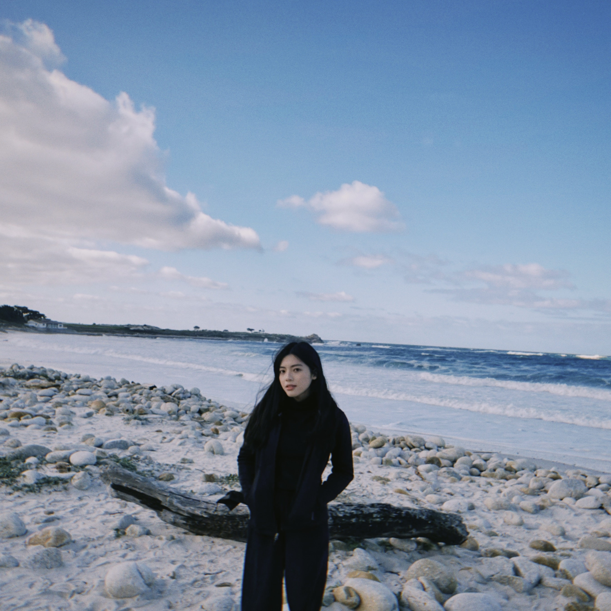

# Updated Project Proposal 

## Stadium Spectacle
Stadium Spectacle is a project intending to shed light on the impacts of publicly funded stadium development in the United States on the makeup of neighborhoods surrounding the stadiums. This will be achieved by examining a few case study stadiums. The stadiums selected are Tmobile Arena in Seattle, Dodger Stadium in Los Angeles, the San Jose SAP Center, and the Oakland-Alameda County Coliseum. 

## Team Members

| Alex Bezirjyan | Cameron Jewett | Yvonne Nguyen  | Camille Wong |
| ------------- | ------------- |------------- | ------------- |
|   |   |   |  |
| Alex is a fourth year Sociology major at UCLA who currently resides in Los Angeles California. After graduation, he plans on pursuing a career in Social Security while simultaneously running his hookah catering business. His interests lie within the realm of conservation as he lives by the biophilia hypothesis code of ethics. In his leisure, he enjoys hiking and fishing in the great outdoors.| Cameron is a fourth year undergrad at UCLA majoring in Environmental Science, with minors in Environmental Systems and Society and Digital Humanities. She is passionate about the intersection of accessibility and sustainability in the corporate sustainability and environmental consulting worlds. In her free time she plays ultimate frisbee for the UCLA D1 Women’s team. | Yvonne is a fourth year Philosophy major and Digital Humanities minor. After graduation, she plans on pursuing a graduate degree in Human and Computer Interaction. She is interested in all aspects of the human experience, particularly how human beings attempt to find meaning and value within the world. | Camille is a first year MFA student in the Design Media Arts Department within the School of the Arts and Architecture. They hold B.A.s in Art and Environmental Studies from the University of California, Santa Barbara. They are a research-based artist invested in finding invisible dynamics of power embedded in technologies, social infrastructures, and the built environment. Their approach spans interactive websites, experimental video, sculpture, and writing, to reveal the extensive influence of power obscured within the texture of social spaces. Drawing from disciplines within digital humanities, urbanism, and experimental geography, their work observes how humans produce that space that in turn, shapes them. |

## Overview
This project opens an investigation across publicly-funded stadiums in the United States under the four major professional sport leagues––the NBA, NFL, MLB, and NHL. With case studies on three major US stadiums: the Safeco/Tmobile Arena in Seattle, Dodger Stadium in Los Angeles, the San Jose SAP Center, and the Oakland-Alameda County Coliseum, this project will follow the historical neighborhoods these stadiums were built in to chart their impact on the surrounding environment. It will ask not only how stadiums affect the demographics of the neighborhood––including race, property value, and median income, but also interrogate the sites of their construction. The purpose of this project is to analyze the neighborhood in which a stadium is built and the economic implications of public subsidies on professional sport facilities. Our method involves comparing Census data (U.S. Census Bureau and Social Explorer) and The Home Owners’ Loan Corporation Redlining Grade Map. This detailed analysis will illustrate the long-term effects of housing segregation in the United States and critically examine the redirection of taxpayer-backed bonds on sports stadiums. 

## Methodology
The web map will show the different locations of each stadium while simultaneously providing information on the impact of its construction within the region. The utilization of mapping will allow for a clear and concise analysis of the stadiums based on their location.

##  Workflow
<iframe style="border: 1px solid rgba(0, 0, 0, 0.1);" width="1000" height="500" src="https://www.figma.com/embed?embed_host=share&url=https%3A%2F%2Fwww.figma.com%2Ffile%2FDJwIbkQaJu2ju5W9vVNfRE%2Fworkflow%3Fnode-id%3D0%253A1" allowfullscreen></iframe>

## Technical scope
<iframe style="border: 1px solid rgba(0, 0, 0, 0.1);" width="1000" height="500" src="https://www.figma.com/embed?embed_host=share&url=https%3A%2F%2Fwww.figma.com%2Ffile%2FQREgu578IsX89t05BNr7fY%2Ftechnical-scope%3Fnode-id%3D0%253A1" allowfullscreen></iframe>
## Geographic scope
The scope of the project will focus on four cities within the U.S––this includes Oakland, CA, San Jose, CA, Los Angeles, CA, and Seattle, Washington.

## Data
We have accumulated the datasets using the Social Explorer platform and we have downloaded the data for 4 cities. We limited our geographic scope to census tracts within the cities of interest. We selected the census tracts based on a 5 mile radius of the stadiums’ location. We also used ARCGIS to find latitude and longitude coordinates for the census tracts of our interest. We aggregated the ARCGIS and Social Explorer data using Excel to make our own datasets. Our datasets can be accessed through [this Google Drive](https://drive.google.com/drive/u/1/folders/1bDz7yzGR7vllpy-Pe6puVagO8zjIkBpg).

## Low-Fidelity Prototype
<iframe style="border: 1px solid rgba(0, 0, 0, 0.1);" width="1000" height="600" src="https://www.figma.com/embed?embed_host=share&url=https%3A%2F%2Fwww.figma.com%2Ffile%2FeYQUfoDWIkTfYXLzYvx3qU%2Fwireflow%3Fnode-id%3D0%253A1" allowfullscreen></iframe>

## Components
1. Navigation Bar with clickable links that takes the user to different pages.
2. Each stadium will have its own page.
3. Filtering option that lets the user different layers of the map. “Census layer” refers to which specfic dataset is used to make that layer (e.g., housing costs or yearly income).
4. When the user is on a given page, the header link relative to that page will show up as a different color.
6. An “About Us”, “Data”, and “Sources” page.
